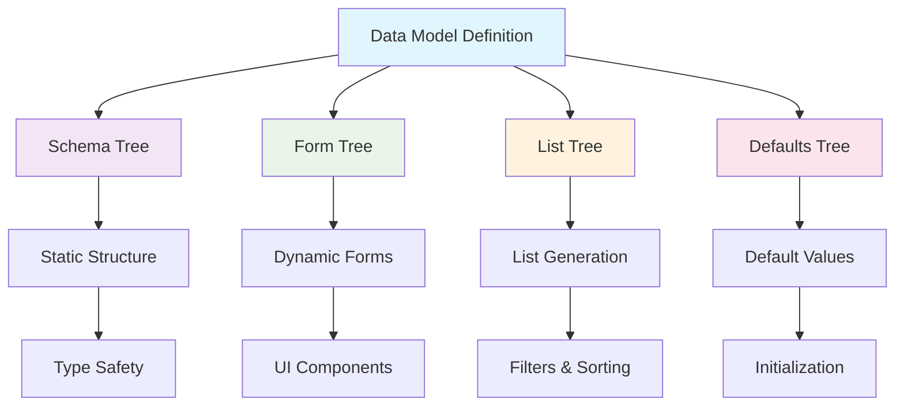
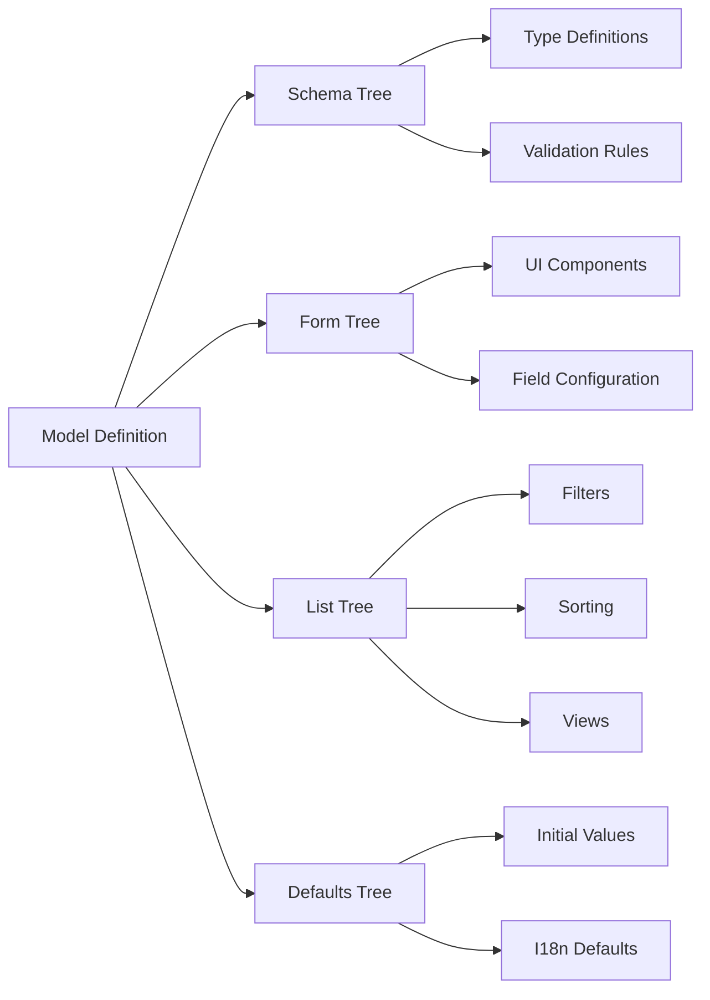
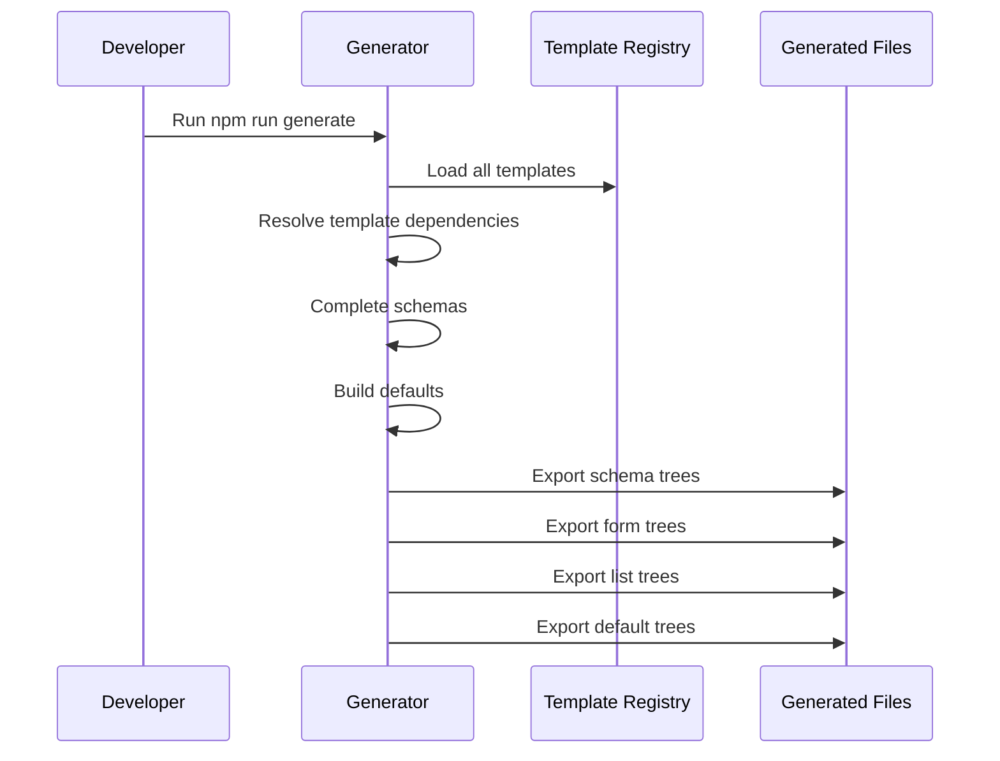

# @paris-ias/data - Canopy Types Module

The `@paris-ias/data` module is the foundational component of the Canopy architecture, implementing the **data-agnostic** and **isomorphic forest** principles. This module provides a comprehensive type system that generates multiple tree structures (schema, form, list, and defaults) from a single source of truth.

## 🏗️ Architecture Overview

The types module implements the core Canopy principle of **isomorphic forests**: each data model is defined by multiple trees with identical structure but containing different values depending on context (browsing lists, creating forms, or integrating data).



## 🌳 Core Concepts

### 1. Five Element Categories

Every data model is composed of five possible element types:

- **Primitive**: Basic values (string, number, boolean) with optional i18n support
- **Object**: Nested structures containing other elements
- **Collection**: Arrays of elements
- **Template**: References to other data models (reusable components)
- **Document**: Database representations with existing data

### 2. Tree Structure Generation

Each model generates four distinct trees:



## Overview

This project defines data models, form schemas, and list configurations, then generates tailored JavaScript modules for both form and list components. It serves as the single source of truth for all data structures and UI configurations.

## 📂 Key Files and Components

### Core Infrastructure

| File | Purpose | Key Exports |
|------|---------|-------------|
| [`src/index.ts`](/home/bob/Projects/types/src/index.ts) | Main entry point with template registry | `templates`, type exports |
| [`src/model.ts`](/home/bob/Projects/types/src/model.ts) | Core model interface definition | `Model` interface |
| [`src/form.ts`](/home/bob/Projects/types/src/form.ts) | Form configuration and validation | `Form`, `formType`, `Rules` |
| [`src/list.ts`](/home/bob/Projects/types/src/list.ts) | List generation configuration | `List`, `Sort`, `Views` |
| [`lib/generate.ts`](/home/bob/Projects/types/lib/generate.ts) | Tree generation engine | Build and export functions |

### Data Model Definitions

The module includes comprehensive data models for academic and research contexts:

| Model | File | Description |
|-------|------|-------------|
| People | [`src/people.ts`](/home/bob/Projects/types/src/people.ts) | Academic profiles with affiliations, disciplines |
| Events | [`src/events.ts`](/home/bob/Projects/types/src/events.ts) | Academic events and conferences |
| Publications | [`src/publications.ts`](/home/bob/Projects/types/src/publications.ts) | Research publications and articles |
| Projects | [`src/projects.ts`](/home/bob/Projects/types/src/projects.ts) | Research projects and initiatives |
| Fellowships | [`src/fellowships.ts`](/home/bob/Projects/types/src/fellowships.ts) | Fellowship programs and applications |
| News | [`src/news.ts`](/home/bob/Projects/types/src/news.ts) | News articles and announcements |

## 🔧 Form Type System

The form type system provides five fundamental types that can be composed infinitely:

```typescript
export enum formType {
  Primitive = "PRIMITIVE",    // Basic values with optional i18n
  Object = "OBJECT",         // Nested structures
  Array = "ARRAY",          // Collections
  Template = "TEMPLATE",    // References to other models
  Document = "DOCUMENT"     // Database entities
}
```

### Form Configuration Interface

```typescript
interface Form {
  type: formType;
  component?: string | boolean;  // UI component to render
  label: string;
  groups?: userRole[];          // Access control
  i18n?: boolean;              // Internationalization flag
  default?: any;               // Default value
  rules?: Rules;              // Validation rules
  show?: Conditional;         // Conditional visibility
  enabled?: Conditional;      // Conditional enablement
  transformers?: Transformers[]; // Value transformations
  items?: any;               // Nested structure
}
```

## 🌐 Internationalization by Default

Every primitive field can be configured for internationalization:

```mermaid
graph TD
    A[Primitive Field] --> B{i18n flag?}
    B -->|true| C[Multi-language Object]
    B -->|false| D[Single Value]
    
    C --> E[{"en": "value", "fr": "valeur"}]
    D --> F["single string value"]
    
    style C fill:#e8f5e8
    style D fill:#fff3e0
```

## 🔄 Template System and Composition

Templates enable infinite composition while maintaining type safety:


## ⚙️ Generation Process

The generation process transforms model definitions into consumable trees:



### Key Generation Functions

| Function | Purpose | Location |
|----------|---------|----------|
| `completeSchema()` | Resolves template references and builds complete schemas | [`lib/generate.ts:104`](/home/bob/Projects/types/lib/generate.ts) |
| `buildDefaults()` | Generates default values for all fields | [`lib/generate.ts:42`](/home/bob/Projects/types/lib/generate.ts) |
| `createJsonFile()` | Exports trees as consumable JSON/JS files | [`lib/utils.ts`](/home/bob/Projects/types/lib/utils.ts) |

## 🎯 Usage Patterns

### 1. Defining a New Model

```typescript
const newModel: Model = {
  source: "gql",              // Data source type
  type: "collection",         // Model type
  list: {                     // List configuration
    create: true,
    filters: { /* ... */ },
    sort: { /* ... */ },
    views: { /* ... */ }
  },
  form: {                     // Form schema
    fieldName: {
      type: formType.Primitive,
      component: "TextField",
      label: "Field Label",
      i18n: true,
      rules: { required: true }
    }
  }
};
```

### 2. Template Composition

```typescript
const complexModel: Model = {
  form: {
    basicInfo: {
      type: formType.Template,
      component: "ObjectField",
      label: "Basic Information",
      items: "people"  // Reference to people template
    }
  }
};
```

## 🔍 Error Handling and Validation

The generation process includes comprehensive error handling:

- **Circular Dependency Detection**: Prevents infinite loops in template references
- **Missing Template Validation**: Ensures all referenced templates exist
- **Schema Validation**: Validates field configurations
- **Type Safety**: Full TypeScript support throughout

## 📦 Build Process

```bash
# Generate all trees from source definitions
npm run generate

# Development mode with watch
npm run dev

# Create dependency visualization
npm run draw
```

## 🤝 Integration with Canopy Ecosystem

The types module serves as the foundation for:

- **[@paris-ias/form](../form)**: Consumes form trees for dynamic UI generation
- **[@paris-ias/list](../list)**: Uses list trees for filtering and sorting
- **[Seed Project](../seed)**: Academic content management
- **[Apex Project](../Apex)**: Full-stack application framework

## 📈 Dependency Graph

The module generates a visual dependency graph showing relationships between models:

```bash
npm run draw  # Generates dependency-graph.svg
```

This creates a comprehensive visualization of how templates reference each other, helping developers understand the data model relationships and identify potential circular dependencies.

## Architecture

### Core Types

```typescript
// Form field types
enum formType {
  Primitive = "PRIMITIVE",    // Simple input fields (text, number, boolean)
  Object = "OBJECT",          // Nested objects with sub-fields
  Array = "ARRAY",            // Collections/arrays of items
  Template = "TEMPLATE",      // References to reusable components
  Document = "DOCUMENT"       // References to other documents/entities
}

// Base model interface
interface Model {
  source: string | null       // Data source ('gql' for GraphQL, 'md' for Markdown)
  type: string | null         // Module type identifier
  list: List                  // List configuration (filters, sorting, views)
  form: Record<string, Form>  // Form schema definition
  aliases?: string[]          // Template aliases for composition
  queryFilters?: any          // GraphQL query filters
  path?: string | null        // File system path for content
}

// Form field definition
interface Form {
  type: formType              // Field type (Primitive, Object, Array, etc.)
  component?: string          // UI component name
  label: string               // Human-readable label
  i18n?: boolean             // Whether label supports internationalization
  default?: any              // Default value
  description?: string        // Help text
  hint?: string | boolean    // Input hint
  rules?: Rules              // Validation rules
  visibility?: Visibility    // Conditional visibility rules
  meta?: string              // Schema.org metadata
  items?: any                // Sub-items for Object/Array types
  multiple?: boolean         // Allow multiple selections
}
```

### Directory Structure

```
types/
├── src/                    # Source type definitions
│   ├── index.ts           # Main exports and configuration data
│   ├── model.ts           # Base model interface
│   ├── form.ts            # Form type definitions and enums
│   ├── list.ts            # List configuration interfaces
│   ├── people.ts          # People model definition
│   ├── events.ts          # Events model definition
│   ├── socials.ts         # Social links template
│   ├── experience.ts      # Work experience template
│   ├── position.ts        # Job position template
│   ├── consent.ts         # GDPR consent template
│   └── ...                # Other models and templates
├── lib/                   # Generation utilities
│   ├── generate.ts        # Main generation logic
│   └── utils.ts          # File I/O utilities
├── dist/                  # Generated output (created by build)
│   ├── list/             # List configurations
│   ├── form/             # Form schemas
│   └── *.js              # Base modules
└── package.json
```

## Data Models

### Core Entities

1. **People**: Person entities with affiliations, social profiles, consent management
2. **Events**: Conferences and events with time slots, speakers, locations
3. **Publications**: Academic publications with metadata and relationships
4. **Projects**: Research projects with team members and related content
5. **Fellowships**: Fellowship programs with application details
6. **News**: News articles with rich media and categorization
7. **Affiliations**: Institutional affiliations and organizational data

### Template Components

Templates are reusable form sections that can be composed into larger forms:

- **socials**: Social media links (website, ORCID, LinkedIn, Twitter, etc.)
- **experience**: Work experience with affiliations and positions
- **position**: Job positions with roles, departments, start/end dates
- **consent**: GDPR consent management checkboxes
- **groups**: User group memberships and roles
- **location**: Geographic location with address and coordinates
- **video**: Video content with metadata and licensing
- **vintage**: Historical program/cohort information

## Generation Process

The generation process transforms TypeScript type definitions into JavaScript modules:

### 1. Schema Resolution
```typescript
// Resolves template dependencies
const completeSchema = (schema: Record<string, Form>) => {
  // Handle different form types
  switch (schema[key]?.type) {
    case formType.Template:
      // Import and merge template definition
      const template = configData[key]
      return completeSchema(template.form)
    case formType.Object:
      // Recursively process nested objects
    case formType.Array:
      // Handle collection types
  }
}
```

### 2. Default Value Generation
```typescript
const buildForm = (schema: Record<string, Form>) => {
  // Creates default form state based on schema
  for (const key of Object.keys(schema)) {
    switch (schema[key]?.type) {
      case formType.Primitive:
        form[key] = schema[key]?.default ?? ""
      case formType.Object:
        form[key] = {} // Nested object
      case formType.Array:
        form[key] = []  // Collection
    }
  }
}
```

### 3. Output Generation
The generator creates three types of outputs:
- **Base modules**: Complete model definitions (deprecated)
- **List modules**: Configuration for list components
- **Form modules**: Schema and defaults for form components

## Usage

### Development Workflow

1. **Define or modify types** in `src/*.ts` files
2. **Run generation**: `npm run generate`
3. **Generated files** appear in `dist/` directory
4. **Import in other projects**:
   ```typescript
   import { formPeople, listPeople } from '@paris-ias/data'
   ```

### Example: People Model

```typescript
// src/people.ts - Source definition
const defaultConfig: Model = {
  source: "gql",
  list: {
    create: true,
    filters: {
      groups: { type: "Select" },
      vintage: { 
        type: "Select",
        visibility: {
          switchIf: [{ groups: "fellows" }]  // Conditional visibility
        }
      }
    },
    sort: {
      nameasc: {
        icon: "sort-alphabetical-ascending",
        text: "by-name-from-a-to-z", 
        value: ["lastname", 1]
      }
    },
    views: {
      dense: { default: true, icon: "land-rows-horizontal" }
    }
  },
  form: {
    firstname: {
      label: "firstname",
      component: "TextField",
      type: formType.Primitive,
      rules: { required: true, min: 1, max: 200 }
    },
    socials: {
      label: "socials", 
      component: "ObjectKeyPairContainer",
      type: formType.Template  // References socials template
    }
  }
}
```

### Generated Output

```javascript
// dist/form/people.js - Generated form schema
export default {
  "_defaults": {
    "firstname": "",
    "lastname": "", 
    "socials": {
      "website": "",
      "orcid": "",
      "linkedin": ""
      // ... expanded from socials template
    }
  },
  "schema": {
    "firstname": {
      "label": "firstname",
      "component": "TextField", 
      "type": "PRIMITIVE",
      "rules": { "required": true, "min": 1, "max": 200 }
    },
    "socials": {
      "label": "socials",
      "component": "ObjectKeyPairContainer",
      "type": "OBJECT",
      "items": {
        "website": { "component": "TextField", "rules": { "url": true } }
        // ... expanded socials fields
      }
    }
  }
}
```

## Validation Rules

The system supports comprehensive validation:

```typescript
interface Rules {
  required?: boolean      // Field is mandatory
  min?: number           // Minimum length/value
  max?: number           // Maximum length/value
  url?: boolean          // Must be valid URL
  color?: boolean        // Must be valid color
  date?: boolean         // Must be valid date
  email?: boolean        // Must be valid email
  orcid?: boolean        // Must be valid ORCID ID
  // ... other validation types
}
```

## Conditional Visibility

Fields and filters can be shown/hidden based on other field values:

```typescript
interface Visibility {
  default?: boolean           // Default visibility state
  switchIf?: any[]           // Conditions to show field
  disjonctive?: boolean      // OR vs AND logic for conditions
}

// Example: Show vintage filter only for fellows
vintage: {
  visibility: {
    default: false,
    switchIf: [{ groups: "fellows" }]
  }
}
```

## Best Practices

### 1. Template Design
- Keep templates focused and reusable
- Use semantic naming conventions
- Document template purpose and usage
- Avoid deep nesting when possible

### 2. Validation Strategy
- Define validation rules at the schema level
- Use consistent validation patterns
- Provide meaningful error messages
- Consider internationalization for messages

### 3. Performance Considerations
- Minimize circular dependencies
- Use appropriate default values
- Consider lazy loading for large schemas
- Optimize generated bundle size


### Debug Mode
Enable verbose logging during generation:
```typescript
// Set DEBUG environment variable
DEBUG=1 npm run generate
```

## Future Enhancements

1. **Enhanced Type Safety**: Generate TypeScript definitions alongside JavaScript
2. **Template Inheritance**: Support for template extension and overrides
3. **Schema Validation**: Runtime validation of schema definitions
4. **Documentation Generation**: Automatic API documentation from schemas
5. **Migration Tools**: Utilities for schema versioning and migration
6. **Performance Optimization**: Lazy loading and tree-shaking improvements

## Contributing

When adding new models or templates:

1. Create TypeScript definition in `src/`
2. Follow existing naming conventions
3. Add comprehensive validation rules
4. Test generation with `npm run generate`
5. Update documentation
6. Consider backward compatibility

This types system provides the foundation for a scalable, type-safe data management ecosystem with excellent developer experience.
