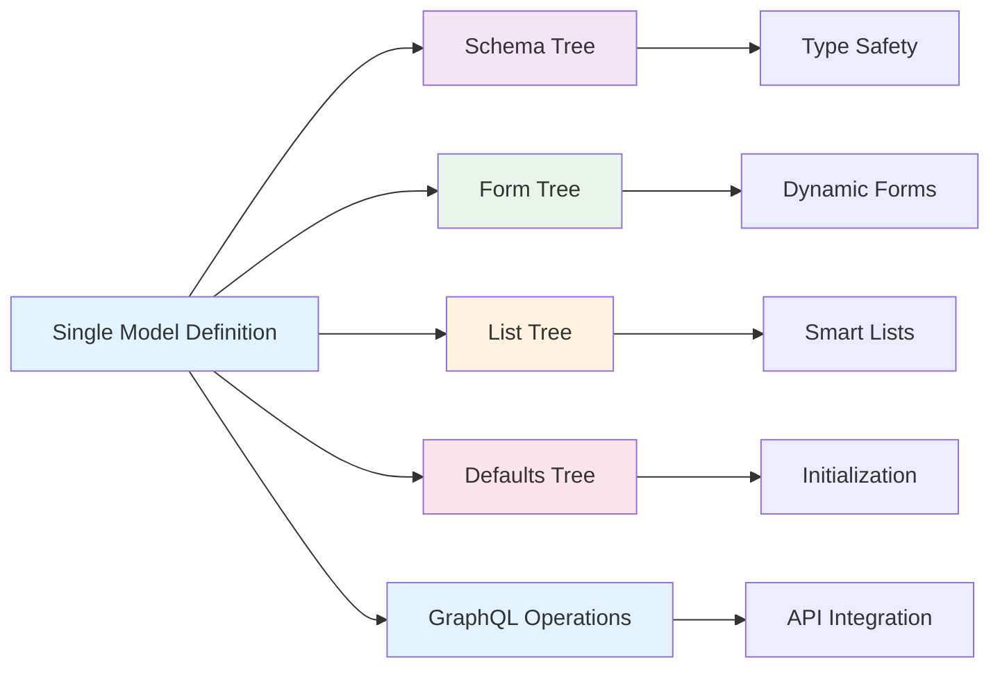
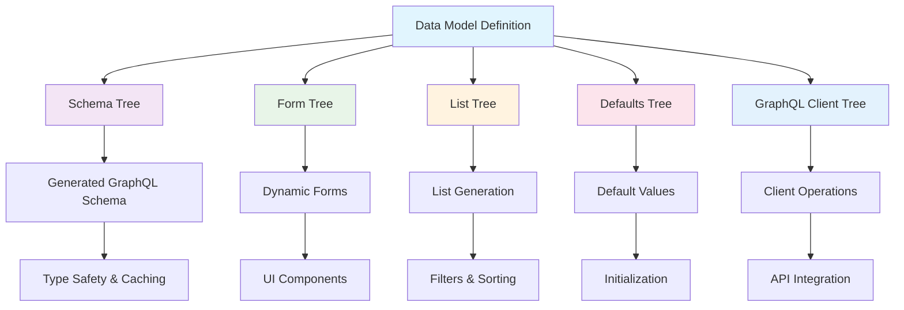

<div align="center">

# 🌳 @paris-ias/trees

**Isomorphic Forest Types Module**

_The foundational data model layer for the Paris IAS ecosystem_

[](https://npmjs.com/package/@paris-ias/trees)
[](LICENSE)
[](https://www.typescriptlang.org/)

[Features](#-features) • [Installation](#-installation) • [Quick Start](#-quick-start) • [Documentation](DOCUMENTATION.md) • [Architecture](#-architecture)

</div>

---

## 🎯 What is @paris-ias/trees?

The trees module is the **single source of truth** for all data structures in the Isomorphic Forest architecture. It implements the core principle of **isomorphic forests**: each data model generates multiple tree structures with identical shapes but different values depending on context.



### Why Isomorphic Forests?

- **🎨 Single Source of Truth**: Define your data model once, generate everything else
- **🔄 Automatic Synchronization**: Changes propagate to forms, lists, APIs, and schemas automatically
- **🌍 I18n by Default**: Built-in internationalization support at the primitive level
- **🧩 Infinite Composition**: Template system enables unlimited reusable components
- **⚡ Type Safety**: Full TypeScript support with generated type definitions
- **📡 GraphQL Ready**: Automatically generates client operations and server schemas

---

## ✨ Features

### 🏗️ Five Element Categories

Every data model is composed of five fundamental types that can be infinitely composed:

| Type           | Description                            | Use Case                                 |
| -------------- | -------------------------------------- | ---------------------------------------- |
| **Primitive**  | Basic values (string, number, boolean) | Input fields, text areas, switches       |
| **Object**     | Nested structures                      | Grouped fields, complex entities         |
| **Collection** | Arrays of elements                     | Lists, multi-select, repeatable sections |
| **Template**   | References to reusable models          | Shared components, composition           |
| **Document**   | Database entity references             | Relations, lookups, foreign keys         |

### 🌲 Five Generated Trees

Each model definition generates five distinct outputs:

```typescript
// 1. Schema Tree - Type definitions and validation, first part used by forms
{
  lastname: { type: "PRIMITIVE", component: "TextField", rules: { required: true } },
  ...
},

// 3. List Tree - Filtering, pagination, views and sorting
People: {
  filters: { status: { type: "Select" } , ...},
  sort: { nameasc: { value: ["lastname", 1] }, ... }
  views: { grid: { default: true, icon: "view-grid" }, ... } // will translate in an expected FormViewsGrid component displaying PeopleGridItems components
  ...
},

// 4. Defaults Tree - Initial values
{
  _defaults: { firstname: "", lastname: "", ... }
  ...
}

```

```graphql
## 5. GraphQL Operations - Ready-to-use queries and mutations

query getPeople($appId: ID = "iea", $itemId: ID = "", $lang: String = "en") {
  getPeople(appId: $appId, itemId: $itemId, lang: $lang) {
    lastname
    affiliations {
      affiliation {
        image {
          alt
          backgroundColor
          caption
          copyright
          license
          licenseUrl
          url
        }
        location {
        ...

## 6. GraphQL Schema

type People {
  appId: String
  firstname: String!
  lastname: String!
  ...

## 7. GraphQL Client Imports


import("@paris-ias/trees/dist/graphql/client/people/query.list.people.gql")
import("@paris-ias/trees/dist/graphql/client/people/query.get.people.gql")

```

---

## 📦 Installation

```bash
# Using npm
npm install @paris-ias/trees

# Using yarn
yarn add @paris-ias/trees

# Using pnpm
pnpm add @paris-ias/trees
```

---

## 🚀 Quick Start

### Importing Generated Trees

```typescript
// Import form and list configurations
import { formPeople, listPeople } from "@paris-ias/trees"

// Import GraphQL operations directly
import("@paris-ias/trees/dist/graphql/client/people/query.list.people.gql")
import("@paris-ias/trees/dist/graphql/client/events/query.get.events.gql")
import(
  "@paris-ias/trees/dist/graphql/client/publications/mutation.create.publication.gql"
)
```

### Defining a New Model

```typescript
import { Model, formType } from "@paris-ias/trees"

const myModel: Model = {
  // List configuration
  list: {
    create: true,
    filters: {
      status: { type: "Select" },
      category: { type: "Select" },
    },
    sort: {
      nameasc: {
        icon: "sort-alphabetical-ascending",
        text: "by-name-from-a-to-z",
        value: ["name", 1],
      },
    },
    views: {
      dense: { default: true, icon: "view-grid" },
    },
  },

  // Form schema
  form: {
    name: {
      type: formType.Primitive,
      component: "TextField",
      label: "name",
      i18n: true,
      rules: { required: true, min: 1, max: 200 },
    },
    description: {
      type: formType.Primitive,
      component: "TextArea",
      label: "description",
      i18n: true,
    },
    // Reuse existing templates
    socials: {
      type: formType.Template,
      component: "ObjectKeyPairContainer",
      label: "socials",
    },
  },
}
```

### Using Templates for Composition

```typescript
// Reference existing templates
form: {
  // Use the built-in socials template
  socials: {
    type: formType.Template,
    component: "ObjectKeyPairContainer",
    label: "socials"
  },

  // Use the position template
  positions: {
    type: formType.Template,
    component: "ArrayContainer",
    label: "positions"
  },

  // Use the location template
  location: {
    type: formType.Template,
    component: "ObjectField",
    label: "location"
  }
}
```

---

## 🏛️ Architecture

### Core Concepts

The trees module implements the **Isomorphic Forest** principle:

1. **Single Definition**: One model definition serves as the source of truth
2. **Multiple Trees**: Each model generates multiple trees with identical structure
3. **Different Values**: Each tree contains values appropriate for its context
4. **Type Safety**: Full TypeScript support throughout the generation process



### Directory (simplified) Structure

```
@paris-ias/trees/
├── src/                        # Source type definitions
│   ├── index.ts               # Template registry & exports
│   ├── model.ts               # Base model interface
│   ├── form.ts                # Form type definitions
│   ├── list.ts                # List configuration
│   ├── people/                # People model
│   │   ├── models/           # TypeScript definitions
│   │   └── graphql/          # GraphQL operations
│   │       ├── client/       # Client-side queries
│   │       └── server/       # Server-side schema
│   ├── events/               # Events model
│   ├── publications/         # Publications model
│   ├── projects/             # Projects model
│   ├── fellowships/          # Fellowships model
│   └── ...                   # Other models
├── lib/                       # Generation utilities
│   ├── generate.ts           # Core generation engine
│   ├── buildSchemas.ts       # GraphQL schema builder
│   ├── buildClientGraphQL.ts # Client operations organizer
│   └── utils.ts             # File I/O utilities
└── dist/                      # Generated output (created by build)
    ├── list/                 # List configurations
    ├── form/                 # Form schemas
    └── graphql/              # GraphQL files
        ├── schemas/          # Server schemas
        │   ├── schema.website.graphql
        │   └── schema.apex.graphql
        └── client/           # Client operations
            ├── people/       # People operations
            ├── events/       # Events operations
            └── ...           # Other operations
```

---

## 📚 Available Models

The module includes comprehensive data models for academic and research contexts. It is freely extensible:

### Core Entities - matching expected documents

| Model            | Description                   | Key Features                                              |
| ---------------- | ----------------------------- | --------------------------------------------------------- |
| **People**       | Academic profiles & directory | Affiliations, positions, social links, consent management |
| **Events**       | Conferences & workshops       | Time slots, speakers, locations, registration             |
| **Publications** | Research papers & articles    | Authors, metadata, citations, related content             |
| **Projects**     | Research projects             | Team members, timeline, funding, deliverables             |
| **Fellowships**  | Fellowship programs           | Applications, cohorts, program details                    |
| **News**         | Announcements & articles      | Rich media, categorization, publishing workflow           |

### Reusable Templates

| Template     | Purpose            | Fields                                          |
| ------------ | ------------------ | ----------------------------------------------- |
| **socials**  | Social media links | Website, ORCID, LinkedIn, Twitter, GitHub, etc. |
| **position** | Job positions      | Role, department, institution, duration         |
| **location** | Geographic data    | Address, coordinates, venue details             |
| **consent**  | GDPR compliance    | Privacy settings, data usage permissions        |
| **groups**   | User roles         | Access control, membership management           |
| **video**    | Video content      | URL, metadata, licensing, thumbnails            |

---

## 🔧 Development

### Generate All Trees

```bash
# Generate all outputs (trees + GraphQL)
npm run generate

# Generate only module trees
npm run generate:modules

# Generate only GraphQL schemas
npm run generate:schemas

# Generate only GraphQL client operations
npm run generate:client

# Development mode with watch
npm run dev
```

### Visualize Dependencies

```bash
# Generate dependency graph
npm run draw

# Output: dependency-graph.svg
```

### Project Structure Commands

```bash
# Clean generated files
npm run clean

# Full rebuild
npm run clean && npm run generate
```

---

## 🌐 Internationalization

Every primitive field supports internationalization out of the box:

```typescript
// Enable i18n for a field
form: {
  title: {
    type: formType.Primitive,
    component: "TextField",
    label: "title",
    i18n: true  // 🌍 Enables multi-language support, fr and en for now
  }
}

// Generated default structure
{
  title: {
    en: "",
    fr: "",
  }
}

// Or single-language when i18n is false
{
  title: ""
}
```

---

## 🔒 Validation System

Comprehensive validation rules for all field types:

```typescript
interface Rules {
  required?: boolean        // Field is mandatory
  min?: number             // Minimum length/value
  max?: number             // Maximum length/value
  url?: boolean            // Valid URL
  email?: boolean          // Valid email
  orcid?: boolean          // Valid ORCID ID
  color?: boolean          // Valid color code
  date?: boolean           // Valid date
  pattern?: RegExp         // Custom regex pattern
  custom?: Function        // Custom validator
}

// Example usage
form: {
  email: {
    type: formType.Primitive,
    component: "TextField",
    label: "email",
    rules: {
      required: true,
      email: true
    }
  },
  website: {
    type: formType.Primitive,
    component: "TextField",
    label: "website",
    rules: {
      url: true
    }
  }
}
```

---

## 🎭 Conditional Visibility, Disability or Function execution

Produce operations based on other field values in forms, and lists filters:

```typescript
form: {
  userType: {
    type: formType.Primitive,
    component: "Select",
    label: "user-type"
  },
  fellowshipYear: {
    type: formType.Primitive,
    component: "Select",
    label: "fellowship-year",
    visibility: {
      default: false,
      switchIf: [{ userType: "fellow" }]  // Only show for fellows
    }
  }
}
```

---

## 📡 GraphQL Integration

### Automatic Schema Generation

Server-side GraphQL schemas are automatically generated:

```graphql
# Generated in dist/graphql/schemas/schema.website.graphql
type People {
  id: ID!
  firstname: String!
  lastname: String!
  email: String
  socials: Socials
  positions: [Position]
}

type Socials {
  website: String
  orcid: String
  linkedin: String
  twitter: String
}
```

### Client Operations

Ready-to-use GraphQL operations for all models:

```typescript
// List queries
import("@paris-ias/trees/dist/graphql/client/people/query.list.people.gql")
import("@paris-ias/trees/dist/graphql/client/events/query.list.events.gql")

// Get single item
import("@paris-ias/trees/dist/graphql/client/people/query.get.people.gql")
import("@paris-ias/trees/dist/graphql/client/events/query.get.events.gql")

// Mutations
import("@paris-ias/trees/dist/graphql/client/people/mutation.upsert.people.gql")
import("@paris-ias/trees/dist/graphql/client/events/mutation.upsert.events.gql")
```

---

## 🤝 Integration with Ecosystem

The trees module is the foundation for the entire Paris IAS ecosystem:

### 🎨 [@paris-ias/form](../form)

Consumes form trees to generate dynamic, type-safe forms with validation

### 📋 [@paris-ias/list](../list)

Uses list trees for advanced filtering, sorting, and view management

### 🌱 [Seed Project](../seed)

Academic content management system built on trees, used foir the Paris IAS website public content

### 🏔️ [Apex Project](../Apex)

Full-stack application framework

---

## 📖 Full Documentation

For comprehensive documentation including:

- Detailed architecture explanations
- Advanced template composition
- Error handling and validation
- Generation process internals
- Best practices and patterns

**👉 See [DOCUMENTATION.md](DOCUMENTATION.md)**

---

## 🤝 Contributing

We welcome contributions! Please follow these steps:

1. **Fork** the repository
2. **Create** a feature branch (`git checkout -b feature/amazing-feature`)
3. **Define** your model in `src/[type]/models/`
4. **Add** GraphQL operations in `src/[type]/graphql/client/` if needed
5. **Test** generation (`npm run generate`)
6. **Commit** your changes (`git commit -m 'Add amazing feature'`)
7. **Push** to the branch (`git push origin feature/amazing-feature`)
8. **Open** a Pull Request

### Contribution Guidelines

- Follow existing naming conventions
- Add comprehensive validation rules
- Include JSDoc comments for public APIs
- Test all generated outputs
- Update documentation for new features
- Consider backward compatibility

---

## 📊 Version Management

We follow [Semantic Versioning](https://semver.org/):

```bash
# Major version (breaking changes)
npm version major

# Minor version (new features, backward compatible)
npm version minor

# Patch version (bug fixes)
npm version patch
```

---

## 📄 License

This project is licensed under the **GNU Affero General Public License v3.0** - see the [LICENSE](LICENSE) file for details.

```
Copyright (C) 2024 Paris Institute for Advanced Study
Author: Antoine Cordelois

This program is free software: you can redistribute it and/or modify
it under the terms of the GNU Affero General Public License as published
by the Free Software Foundation, either version 3 of the License, or
(at your option) any later version.
```

---

## 🙏 Acknowledgments

Developed and maintained by the **Paris Institute for Advanced Study** as part of its projects.

Imagined and designed by Antoine Cordelois, with the great help of Hamed Bouare.

---

### Contributors

<a href="https://github.com/Billybobbonnet"></a>
<a href="https://github.com/hbouare"></a>

---

<div align="center">

**[Documentation](DOCUMENTATION.md)** • **[Issues](https://github.com/IEA-Paris/Apex/issues)** • **[Discussions](https://github.com/IEA-Paris/Apex/discussions)**

Made with ❤️ by [Paris IAS](https://www.paris-iea.fr)

</div>
